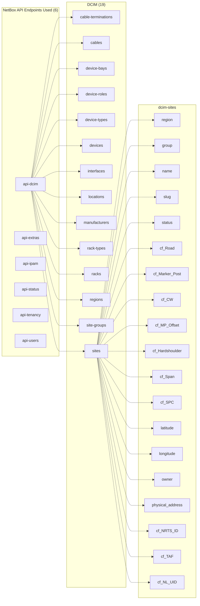

## NRTS taxonomy v1

```mermaid

flowchart LR

    subgraph API-used["NetBox API Endpoints Used (6)"]
        API3[api-dcim]
        API4[api-extras]
        API5[api-ipam]
        API7[api-status]
        API8[api-tenancy]
        API9[api-users]
    end

    subgraph dcim["DCIM (19)"]
        D1[cable-terminations]
        D2[cables]
        D3[device-bays]
        D4[device-roles]
        D5[device-types]
        D6[devices]
        D7[interfaces]
        D8[locations]
        D9[manufacturers]
        D10[rack-types]
        D11[racks]
        D12[regions]
        D13[site-groups]
        D14[sites]
    end


    subgraph dcim-sites
        D14-1[region]
        D14-2[group]
        D14-3[name]
        D14-4[slug]
        D14-5[status]
        D14-6[cf_Road]
        D14-7[cf_Marker_Post]
        D14-8[cf_CW]
        D14-9[cf_MP_Offset]
        D14-10[cf_Hardshoulder]
        D14-11[cf_Span]
        D14-12[cf_SPC]
        D14-13[latitude]
        D14-14[longitude]
        D14-15[owner]
        D14-16[physical_address]
        D14-17[cf_NRTS_ID]
        D14-18[cf_TAF]
        D14-19[cf_NL_UID]
    end

    %% ALL CONNECTIONS VERIFIED
    API3 -.-> D1 & D2 & D3 & D4 & D5 & D6 & D7 & D8 & D9 & D10 & D11 & D12 & D13 & D14
    D14 -.-> D14-1 & D14-2 & D14-3 & D14-4 & D14-5 & D14-6 & D14-7 & D14-8 & D14-9 & D14-10 & D14-11 & D14-12 & D14-13 & D14-14 & D14-15 & D14-16 & D14-17 & D14-18 & D14-19

```
