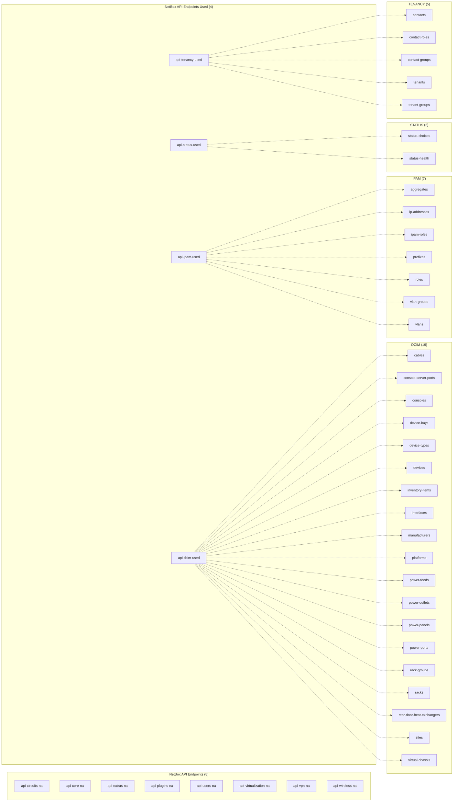

## NRTS taxonomy v1

```mermaid

flowchart LR
    subgraph API["NetBox API Endpoints (8)"]
        API1[api-circuits-na]
        API2[api-core-na]
        API4[api-extras-na]
        API6[api-plugins-na]
        API9[api-users-na]
        API10[api-virtualization-na]
        API11[api-vpn-na]
        API12[api-wireless-na]
    end

    subgraph API-used["NetBox API Endpoints Used (4)"]
        API3[api-dcim-used]
        API5[api-ipam-used]
        API7[api-status-used]
        API8[api-tenancy-used]
    end

    subgraph dcim["DCIM (19)"]
        D1[cables]
        D2[console-server-ports]
        D3[consoles]
        D4[device-bays]
        D5[device-types]
        D6[devices]
        D7[inventory-items]
        D8[interfaces]
        D9[manufacturers]
        D10[platforms]
        D11[power-feeds]
        D12[power-outlets]
        D13[power-panels]
        D14[power-ports]
        D15[rack-groups]
        D16[racks]
        D17[rear-door-heat-exchangers]
        D18[sites]
        D19[virtual-chassis]
    end

      subgraph ipam["IPAM (7)"]
        I1[aggregates]
        I2[ip-addresses]
        I3[ipam-roles]
        I4[prefixes]
        I5[roles]
        I6[vlan-groups]
        I7[vlans]
    end

    subgraph status["STATUS (2)"]
        S1[status-choices]
        S2[status-health]
    end

    subgraph tenancy["TENANCY (5)"]
        T1[contacts]
        T2[contact-roles]
        T3[contact-groups]
        T4[tenants]
        T5[tenant-groups]
    end

    %% ALL CONNECTIONS VERIFIED
    API3 -.-> D1 & D2 & D3 & D4 & D5 & D6 & D7 & D8 & D9 & D10 & D11 & D12 & D13 & D14 & D15 & D16 & D17 & D18 & D19
    API5 -.-> I1 & I2 & I3 & I4 & I5 & I6 & I7
    API7 -.-> S1 & S2
    API8 -.-> T1 & T2 & T3 & T4 & T5
```
 
